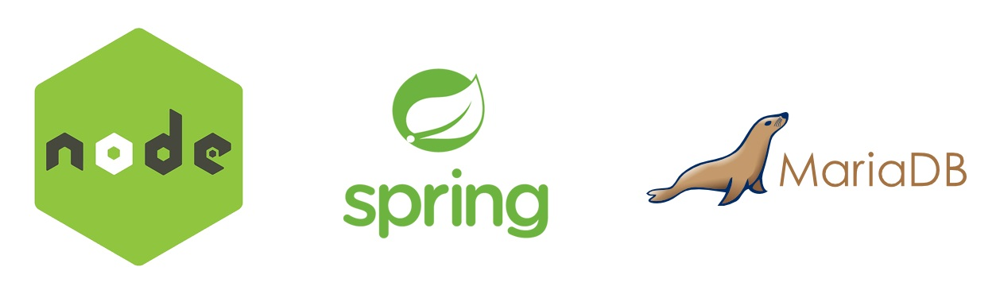

# 🤝 다수 협업형 개발자 블로그 Welog

##  소개

> Wiki + we + blog
>
> Welog는 잘못된 정보나 오류를 바로잡기 위해 불특정 다수가 내용과 구조의 수정 요청을 할 수 있는  다수 협업형 개발자 블로그 입니다.

## 기술 스택

### Backend

- node js

- spring

- mariaDB

  

### Frontend

- vue js / vuex

- bootstrap

  

### 이슈관리

- git flow

- source tree

- jira

### 배포

- aws

## 주요 기능 소개

- 글을 작성할 때에 🏷태그를 입력할 수 있고 태그도 🔎검색이 가능하여 검색이 용이합니다.

- 📝마크다운 에디터를 이용하여 마크다운 형식으로 작성이 가능하며 작성이 완료되면 h1~3 태그를 자동으로 인식하여 문서 우측에 📄목차를 제공합니다.
- 타인이 작성한 문서를 읽을 때에 잘못 된 내용을 정정하고 싶을 경우 문장단위로 수정요청을 남길 수 있습니다. 그렇게 할 경우 작성자는 실시간으로 🔔알람을 받을 수 있습니다.
- 내 프로필 페이지에서 📤내가 보낸 수정요청들과 📥내가 받은 수정요청들을 한 눈에 확인 할 수 있습니다.

## 세부 기능 일람

- 회원가입
- 로그인 / 로그아웃
  - 소셜 로그인
- 글 조회 
  - 최신순 / 인기순
  - 제목 / 내용 / 태그 🔎검색
  - 무한스크롤 적용
- 글 작성
  - 🏷태그 추가 가능
  - 📝Markdown 형식으로 입력 가능
    -  h1~3 태그를 자동으로 인식하여 📄목차를 제공
  - 글 수정 및 ❌삭제 가능
- 글 내용 조회
  - 👍글 좋아요
  - ❗ 수정 요청
  - 💬코멘트 작성
    - 🔓비밀글 가능
    - 코멘트 수정, ❌삭제 가능
  - 문장 단위로 수정요청 가능
    - 문서 작성자는 실시간으로 🔔알람을 받음
- 개인 블로그 페이지
  - 유저 작성글 조회
  - 유저 소개글 작성 및 수정 가능
- 내 프로필 페이지
  - 👤프로필 이미지 설정 가능
  - 📤내가 보낸 / 📥받은 수정 요청 확인 가능

## 🌺 Contributor

- Backend 

- Frontend

